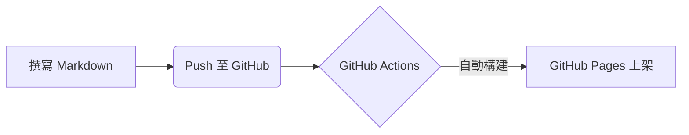

這是一篇用來測試 **Jekyll Chirpy** 主題各項排版與渲染功能的測試文章。（由 Gemini 產生）

## 1. 程式碼區塊與高亮 (Code Highlight)

支援語法高亮、列號與右上角的**一鍵複製按鈕**：

```kotlin
// Kotlin 測試範例
fun main() {
    val languages = listOf("Kotlin", "Java", "Markdown")
    println("Hello, Jekyll Chirpy!")
    
    for (lang in languages) {
        println("I love writing in $lang")
    }
}
```

---

## 2. LaTeX 數學公式 (MathJax)

在 Front Matter 開啟 `math: true` 後，即可渲染數學公式：

* **行內公式**：經典的質能等效公式是 $E = mc^2$。
* **獨立區塊公式**：

$$
\int_{0}^{\infty} e^{-x^2} dx = \frac{\sqrt{\pi}}{2}
$$

---

## 3. Mermaid 流程圖

在 Front Matter 開啟 `mermaid: true` 後，可以直接用文字畫圖：



---

## 4. 特殊提示框 (Prompt / Admonition)

Chirpy 提供了多種美觀的提示區塊：

> 光是設定好 GitHub Pages 就跨出了技術部落格的第一步！
{: .prompt-tip }

> 提示：檔名一定要遵守 `YYYY-MM-DD-title.md` 格式才能正確被讀取。
{: .prompt-info }

> 注意：切勿在公開倉庫中寫入敏感的 API Key 或密碼。
{: .prompt-warning }

---

## 5. 圖片與圖卡

可以輕鬆加入帶有說明文字的圖片：


_Chirpy 官方預設圖示_